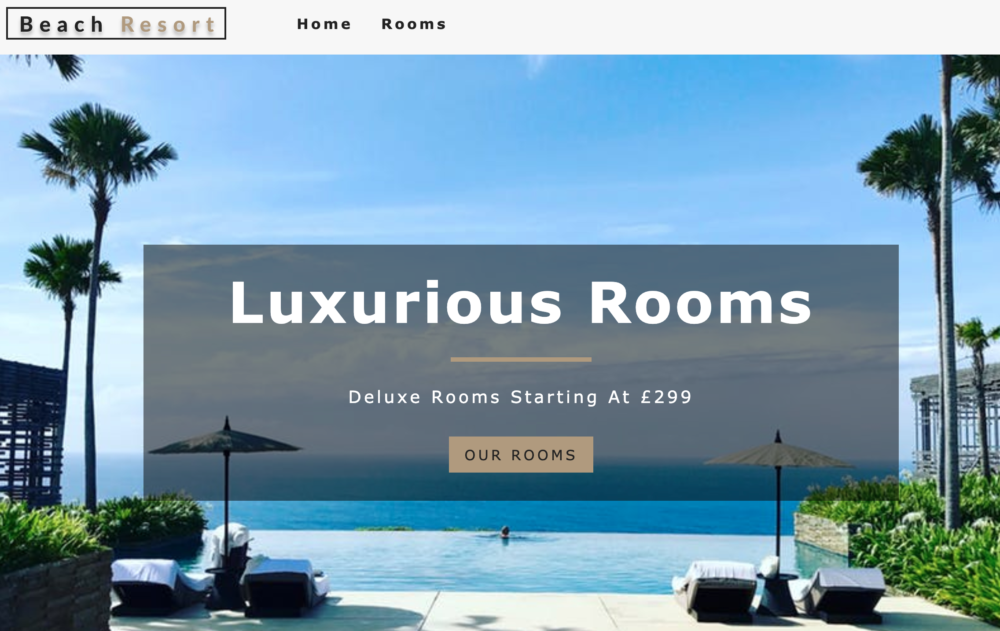
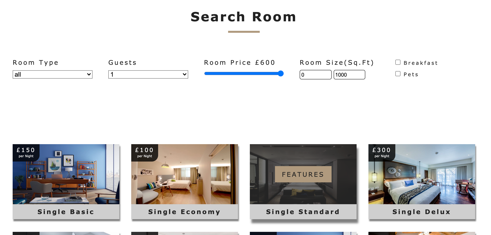

## Hotel Page Project

Great tutorial project learning to use React in a lot more detail.

Using class components, functional components, hooks, state, router, global context, env variables, React forms.

Finally used contenful as a hosting provider for the data and deployed the site using Netlify.

Great learning project, really pushed my React skills and knowledge to a new level

Live site hosted at: https://danhotelreactdemo.netlify.app/

